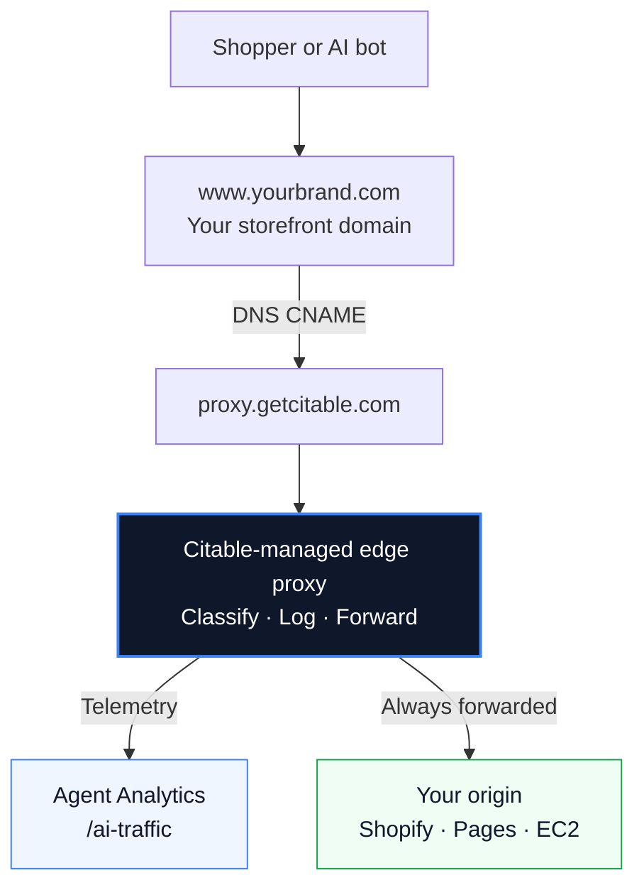

The **AI Traffic Proxy (Managed)** is Citable's fully hosted edge integration. Citable runs the Cloudflare Workers, provisions ingest credentials, and registers your hostname — you add a DNS CNAME and verify in Connectors.

<Warning>
  This integration is available to **trusted partners** on a managed basis. Citable operates the edge proxy and ingest pipeline on your behalf. **Contact us before you start** — we enable the connector on your account and walk you through DNS.
</Warning>

Google Analytics shows when a human clicks through from ChatGPT or Perplexity. The managed proxy goes further — it captures GPTBot crawling your product pages, autonomous agents at checkout, and every other request that hits your storefront before it reaches your origin.

## Who this is for

| Managed AI Traffic Proxy | [Self-hosted Cloudflare Worker](/integrations/cloudflare-worker) |
| --- | --- |
| You want Citable to run everything | You have your own Cloudflare zone and engineering team |
| Shopify or generic web storefront | Any site you can route through your CF Worker |
| Add a CNAME → `proxy.getcitable.com` | Deploy a Worker on your domain |
| **Contact Citable to enable** | **Connectors** → self-provision `siteId` + ingest token, then deploy |

Not sure which path fits? [Contact us](https://getcitable.com) — we can recommend an approach and help with setup.

## What you get

Once the proxy is active, **Agent Analytics** (`/ai-traffic`) shows edge traffic beyond what GA4 captures:

| Traffic type | What it is | Example |
| --- | --- | --- |
| **Crawlers** | LLM bots indexing your catalog | GPTBot, ClaudeBot, PerplexityBot |
| **AI referrals** | Humans arriving from an AI platform | Click from ChatGPT, Perplexity, Gemini |
| **Agents** | Autonomous systems acting on your store | Direct-to-checkout, API-style purchase flows |
| **Human** | Normal storefront visitors | Organic shoppers (baseline) |

The **Edge Traffic** and **Activity Log** tabs populate from the proxy. GA4 tabs continue to work independently if you have Google Analytics connected.

## How it works



Citable registers your hostname, routes traffic through our shared edge proxy Worker, classifies each request, and forwards it to your origin. Your site stays online throughout — traffic always reaches your origin.

You do **not** deploy Workers, manage ingest tokens, or call `ingest.getcitable.com` yourself. See [Ingest Pipeline](/integrations/ingest-pipeline) for what happens behind the scenes.

## Get started

### Step 1 — Contact Citable

Email or reach out via [getcitable.com](https://getcitable.com) to request managed AI Traffic Proxy access. Include:

- Your Citable brand / account
- Storefront hostname (e.g. `www.yourbrand.com`)
- Origin type (Shopify `*.myshopify.com`, Cloudflare Pages, custom host)
- Whether you need same-zone setup (e.g. `getcitable.com` itself)

We enable the connector on your account and confirm the right connect profile before you touch DNS.

### Step 2 — Connect in Citable

After we enable your account:

1. Open **Settings → Connectors** in Citable.
2. Find the **AI Traffic Proxy** card and click **Connect**.
3. Enter your **store domain** and **storefront hostname** as directed.
4. Click **Start setup**.

Citable provisions SSL, Worker routes, and ingest credentials on our infrastructure.

### Step 3 — Add the CNAME record

In your DNS provider (Shopify, Cloudflare, Route 53, etc.), create:

```
Type:   CNAME
Name:   www          (or the subdomain you entered — e.g. `www` for www.mystore.com)
Target: proxy.getcitable.com
```

<Tip>
  Use the **Copy CNAME** button on the connector card — it copies the exact record your DNS panel needs.
</Tip>

<Note>
  Most brands use `www.yourbrand.com` for the proxy hostname. Apex domains (`yourbrand.com` without `www`) often need `www` for the CNAME — set up the proxy on `www` and redirect apex traffic there.
</Note>

### Step 4 — Verify and go live

1. After adding the CNAME, return to **Settings → Connectors**.
2. Click **Verify DNS** on the AI Traffic Proxy card.
3. When hostname and SSL are both active, the status changes to **Active**.

Open **Agent Analytics** (`/ai-traffic`) and check the **Edge Traffic** tab. Data typically appears within a few minutes as crawlers and shoppers hit your storefront.

## What Citable manages

| You configure | Citable manages |
| --- | --- |
| Storefront hostname + CNAME | `citable-edge-proxy` Worker route |
| Origin hostname (Connectors form) | Cloudflare KV site config |
| — | Per-site ingest auth token |
| — | Ingest → queue → ClickHouse pipeline |
| — | SSL / custom hostname (external domains) |

Citable inspects HTTP request metadata — headers, paths, referrer, bot signals — to classify traffic. We do not read Shopify admin data, orders, or customer PII beyond normal request metadata. We do not block or throttle traffic; everything is forwarded to your origin.

Disconnecting removes routing registration and stops new edge telemetry. Your DNS CNAME is unchanged — remove it yourself if you no longer want traffic routed through Citable.

## Common questions

<AccordionGroup>
  <Accordion title="Can I self-serve the proxy without contacting Citable?">
    Not for the managed integration. The managed proxy runs on Citable's Cloudflare account and Workers. If you have your own Cloudflare zone, see [Self-hosted Cloudflare Worker](/integrations/cloudflare-worker) — provision credentials in Connectors and deploy the Worker yourself.
  </Accordion>

  <Accordion title="Verify DNS shows 'still provisioning'">
    Confirm the CNAME points to `proxy.getcitable.com` (not your origin). DNS propagation can take up to 30 minutes. SSL issuance usually follows within a few minutes after DNS is correct. Click **Verify DNS** again after waiting.
  </Accordion>

  <Accordion title="Edge Traffic shows 'not connected' but Connectors says Active">
    Make sure you are viewing the correct brand in Citable. Refresh Agent Analytics. If the status hasn't updated, contact us or disconnect and reconnect from Connectors.
  </Accordion>

  <Accordion title="Will this slow down my store?">
    The proxy adds minimal latency. Telemetry runs in the background while requests are forwarded to your origin immediately.
  </Accordion>
</AccordionGroup>

## Alternatives

- **[Self-hosted Cloudflare Worker](/integrations/cloudflare-worker)** — deploy a Worker on your zone; credentials from Connectors
- **[Google Analytics](/integrations/google-analytics)** — AI-referred human sessions only (no crawler/agent visibility).
- **[Ingest Pipeline](/integrations/ingest-pipeline)** — how classified events are stored after the edge Worker runs.
