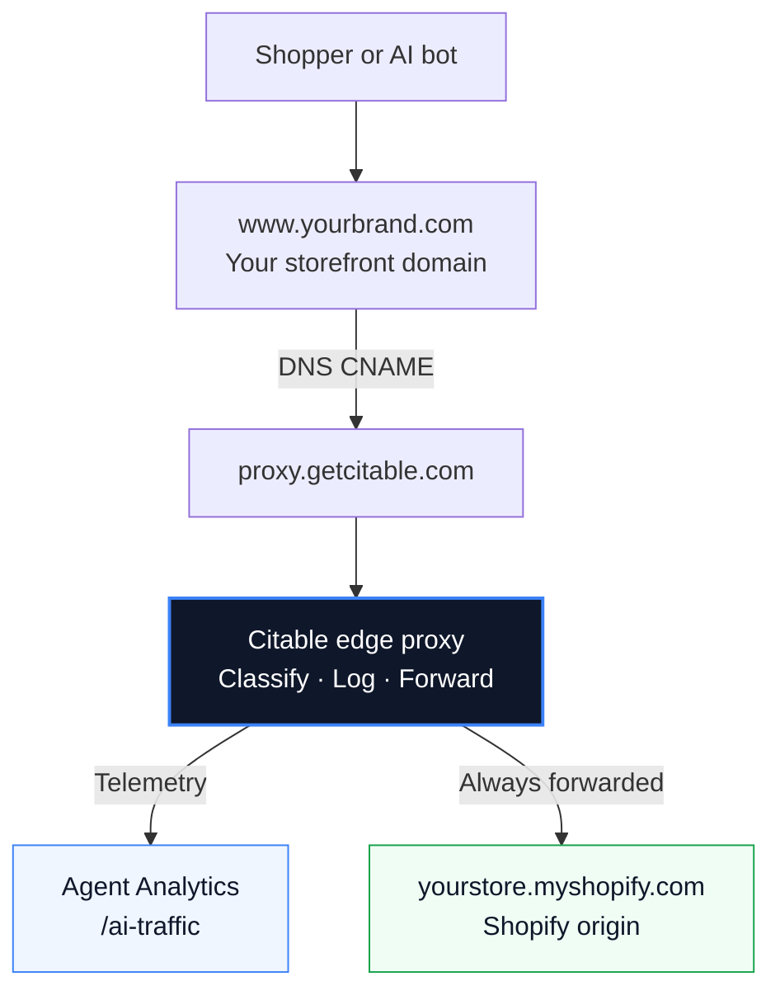

Google Analytics shows when a human clicks through from ChatGPT or Perplexity. The AI Traffic Proxy goes further — it captures GPTBot crawling your product pages, autonomous agents at checkout, and every other request that hits your storefront before it reaches Shopify.

## What you get

Once the proxy is active, **Agent Analytics** (`/ai-traffic`) shows edge traffic beyond what GA4 captures:

| Traffic type | What it is | Example |
| --- | --- | --- |
| **Crawlers** | LLM bots indexing your catalog | GPTBot, ClaudeBot, PerplexityBot |
| **AI referrals** | Humans arriving from an AI platform | Click from ChatGPT, Perplexity, Gemini |
| **Agents** | Autonomous systems acting on your store | Direct-to-checkout, API-style purchase flows |
| **Human** | Normal storefront visitors | Organic shoppers (baseline) |

The **Edge Traffic** and **Activity Log** tabs in Agent Analytics populate from the proxy. GA4 tabs continue to work independently if you have Google Analytics connected.

## Prerequisites

Before you start, make sure you have:

- A **Shopify** store on a `*.myshopify.com` domain
- A **custom storefront domain** shoppers actually visit (e.g. `www.yourbrand.com`)
- **DNS access** to add a CNAME record for that storefront domain
- The storefront domain should be the one you use in marketing — not your Shopify admin URL

<Note>
  Most Shopify merchants use `www.yourbrand.com` as the storefront hostname. Apex domains (`yourbrand.com` without `www`) typically need `www` for the CNAME. Set up the proxy on `www` and redirect apex traffic there.
</Note>

## How it works



Citable registers your storefront hostname, routes traffic through the edge proxy, and forwards every request to Shopify. Your storefront stays online throughout — traffic always reaches Shopify.

## How to connect

1. Open **Settings → Connectors** in Citable.
2. Find the **AI Traffic Proxy** card and click **Connect**.
3. Enter your **Shopify store domain** — your `*.myshopify.com` admin domain (e.g. `mystore.myshopify.com`).
4. Enter your **storefront domain** — the hostname shoppers visit (e.g. `www.mystore.com`).
5. Click **Start setup**.

Citable provisions SSL and routing for your hostname. When setup completes, the connector card shows the CNAME record you need to add.

## Add the CNAME record

In your DNS provider (Shopify, Cloudflare, Route 53, etc.), create:

```
Type:   CNAME
Name:   www          (or the subdomain you entered — e.g. `www` for www.mystore.com)
Target: proxy.getcitable.com
```

<Tip>
  Use the **Copy CNAME** button on the connector card — it copies the exact record in the format your DNS panel needs.
</Tip>

DNS changes can take a few minutes to propagate. SSL certificate provisioning usually completes shortly after the CNAME is live.

## Verify and go live

1. After adding the CNAME, return to **Settings → Connectors**.
2. Click **Verify DNS** on the AI Traffic Proxy card.
3. When hostname and SSL are both active, the status changes to **Active**.

Open **Agent Analytics** (`/ai-traffic`) and check the **Edge Traffic** tab. Data typically appears within a few minutes of activation as crawlers and shoppers hit your storefront.

## What Citable sees

The proxy inspects HTTP requests to your storefront — headers, paths, referrer, and bot signals:

- Count requests by traffic type (crawler, AI referral, agent, human)
- Show which pages bots and agents are hitting
- Log high-signal events for crawlers and agents

Citable does not read Shopify admin data, orders, or customer PII beyond normal HTTP request metadata. It does not modify your DNS or Shopify settings, and it does not block or throttle traffic — everything is forwarded to Shopify.

Disconnecting removes the CNAME routing registration and stops new edge telemetry. Your storefront DNS is unchanged — you remove the CNAME yourself if you no longer want traffic routed through Citable.

## Common questions

<AccordionGroup>
  <Accordion title="Verify DNS shows 'still provisioning'">
    Confirm the CNAME points to `proxy.getcitable.com` (not your Shopify origin). DNS propagation can take up to 30 minutes. SSL issuance usually follows within a few minutes after DNS is correct. Click **Verify DNS** again after waiting.
  </Accordion>

  <Accordion title="Activating the proxy on your account">
    Contact [support](https://getcitable.com) to enable the proxy for your Citable account. No changes are needed on your Shopify or DNS side until activation is complete.
  </Accordion>

  <Accordion title="Edge Traffic shows 'not connected' but Connectors says Active">
    Make sure you are viewing the correct brand in Citable. Refresh Agent Analytics. If the status hasn't updated yet, disconnect and reconnect from Connectors.
  </Accordion>

  <Accordion title="I only have an apex domain (no www)">
    Many DNS providers don't support a CNAME at the zone apex. Use `www.yourbrand.com` for the proxy and set up an apex redirect to `www` in your DNS or Shopify settings.
  </Accordion>

  <Accordion title="Will this slow down my store?">
    The proxy adds minimal latency. Telemetry runs in the background while requests are forwarded to Shopify immediately.
  </Accordion>
</AccordionGroup>

## Without the proxy

Agent Analytics works with **Google Analytics** alone — connect GA4 from Connectors to see AI-referred human sessions. For crawler and agent traffic, add the proxy — those requests typically skip JavaScript and sit outside GA4.

For most Shopify brands serious about AI commerce visibility, connecting both GA4 and the AI Traffic Proxy gives the fullest picture.
