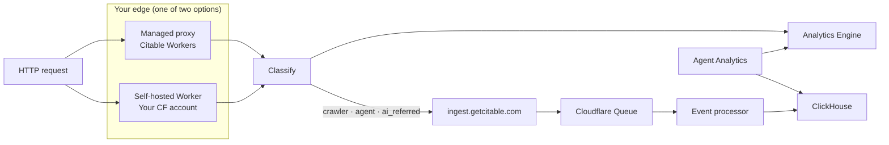

The **ingest pipeline** is Citable's backend path for high-signal edge traffic: classify at the edge → POST to ingest → queue → ClickHouse → **Agent Analytics**.

There are **two ways** to get data into this pipeline:

| Path | Who runs the Worker | How to start |
| --- | --- | --- |
| **[AI Traffic Proxy (Managed)](/integrations/ai-traffic-proxy)** | Citable | [Contact us](https://getcitable.com) → enable connector → add CNAME |
| **[Cloudflare Worker (Self-Hosted)](/integrations/cloudflare-worker)** | You | **Connectors** → Self-hosted Worker → copy `siteId` + token → deploy |

<Note>
  **Managed** partners contact Citable before setup — we operate the edge stack. **Self-hosted** teams self-provision ingest credentials in Connectors; contact us only if you want hands-on help.
</Note>

## What the pipeline does

Every classified request produces telemetry in one or both stores:

| Traffic type | Analytics Engine | ClickHouse (via ingest) |
| --- | --- | --- |
| **Crawler** | Yes | Yes |
| **Agent** | Yes | Yes |
| **AI referral** | Yes | Yes |
| **Human** | Yes | No |

**Analytics Engine** powers live counts (overview, time series, bot breakdown). **ClickHouse** holds row-level events for lag analysis, joins, and long retention.

## Architecture



The edge layer always forwards requests to your origin. Telemetry is fire-and-forget and does not block responses.

## Authentication

Ingest accepts `POST https://ingest.getcitable.com` with header `x-auth-token`.

| Path | Who gets the token | Who uses it |
| --- | --- | --- |
| **Managed proxy** | Citable generates on connect — **never shown in UI** | Citable's `citable-edge-proxy` Worker |
| **Self-hosted Worker** | **You create in Connectors** — shown once, copy to Wrangler secret | Your Worker (`CITABLE_INGEST_TOKEN`) |

We store `token:{token}` → `siteId` in Cloudflare KV. Ingest returns `401` for missing, invalid, or revoked tokens.

### Event payload

Minimum fields your Worker (or our edge proxy) must send:

```json
{
  "siteId": "www.example.com",
  "proxyHost": "www.example.com",
  "timestamp": 1719000000000,
  "trafficType": "crawler",
  "botName": "GPTBot",
  "aiSource": "",
  "referrer": "",
  "urlPath": "/products/handle",
  "method": "GET",
  "country": "US",
  "cfBotScore": 99,
  "confidence": 0.85
}
```

`siteId` must match the value Citable registered when we provisioned your credentials.

## Choose your path

### Managed — trusted partners

Best when you want Citable to operate the full stack:

1. [Contact Citable](https://getcitable.com) to request managed proxy access
2. Follow [AI Traffic Proxy (Managed)](/integrations/ai-traffic-proxy)
3. Add CNAME → `proxy.getcitable.com`, verify in Connectors

No Worker deployment, no ingest configuration on your side.

### Self-hosted — your Cloudflare zone

Best when you already manage Cloudflare Workers:

1. Open **Connectors** → **AI Traffic Proxy** → **Self-hosted Cloudflare Worker**
2. Copy `siteId` and ingest token into your Worker (see [Cloudflare Worker guide](/integrations/cloudflare-worker))
3. Deploy on your zone

You operate the Worker; Citable operates ingest → ClickHouse → dashboard. [Contact us](https://getcitable.com) if you want setup help.

## Verify data is flowing

1. **Agent Analytics** → **Edge Traffic** — overview and bot breakdown (Analytics Engine)
2. High-signal events should reach ClickHouse within about a minute of test traffic
3. For self-hosted: run the `curl` smoke test in the [Cloudflare Worker guide](/integrations/cloudflare-worker#test-your-implementation)

If overview counts work but ClickHouse-backed features do not, the ingest pipeline may be stalled — contact [getcitable.com](https://getcitable.com).

## Common questions

<AccordionGroup>
  <Accordion title="Can I use ingest without a Worker?">
    Ingest expects classified edge events in the `ObserveEvent` format. In practice you need a Worker (managed or self-hosted) on the request path. Direct browser or server calls are not the intended integration.
  </Accordion>

  <Accordion title="Do I need separate ingest setup for managed proxy?">
    No. When Connectors shows **Active**, Citable has already provisioned KV, the ingest token, and edge-proxy routing. You only add DNS.
  </Accordion>

  <Accordion title="Can I switch from self-hosted to managed later?">
    Yes — [contact us](https://getcitable.com). We can migrate your `siteId`, provision managed routes, and coordinate token rotation so there is no gap in telemetry.
  </Accordion>

  <Accordion title="I lost my self-hosted ingest token">
    Disconnect the self-hosted connector in Connectors and create new credentials, or use **Regenerate token** when available. Update your Worker secret with `npx wrangler secret put CITABLE_INGEST_TOKEN`.
  </Accordion>

  <Accordion title="Does disconnecting revoke my token?">
    **Managed:** disconnecting in Connectors deletes KV entries and revokes the token. **Self-hosted:** contact us to revoke; remove or update the secret in your Worker.
  </Accordion>
</AccordionGroup>

## Related

- [AI Traffic Proxy (Managed)](/integrations/ai-traffic-proxy)
- [Cloudflare Worker (Self-Hosted)](/integrations/cloudflare-worker)
- [Google Analytics](/integrations/google-analytics) — complementary; does not replace edge crawler/agent visibility
