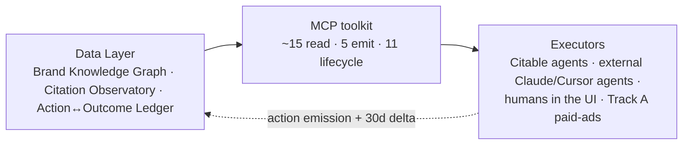

The arrow back from Executors to the Data Layer is the moat. Every action an executor takes goes into the ledger; thirty days later the system measures what happened next; that becomes input to the next round.

## The data layer

| Surface | Role | Schema |
|---|---|---|
| Brand Knowledge Graph | What the brand IS, who it competes with, who it talks to | `brands`, `s_brand_competitors`, `personas`, `s_prompts` |
| Citation Observatory | What AI engines actually say about the brand right now | `s_analysis_results`, `d_visibility_history`, `share_of_voice_pct` |
| Action↔Outcome Ledger | What Citable did, and what happened next | `action_outcome_ledger` (Slice 1) |
| Cross-brand benchmarks | Cohort-level "brands like yours got X from action Y" — k-anonymity ≥5 | `cross_brand_benchmarks` (Slice 4, internal-only v1) |

## The MCP toolkit

One typed contract per platform action. Same surface serves external agents (Claude Desktop, Cursor, ChatGPT MCP), our own internal agent runner, the React frontend, and Track A's paid-ads operating layer.

| Category | Tools | Why grouped |
|---|---|---|
| **Coarse emit** | `emit_content`, `emit_outreach`, `emit_technical`, `emit_operational`, `emit_paid` | One semantic action per class. Every one funnels through persona-intent validation + ledger emission. |
| **Read** | `get_brand_context`, `get_topical_authority`, `get_action_outcome_history`, ... | Brand-state grounding + 4-card funnel + history. Defaults to non-branded scope. |
| **Fine-grained lifecycle** | `create_content_draft`, `schedule_content`, `mark_content_posted`, etc. | Human-UI flows. Agents prefer the coarse `emit_*` tools but the fine ones stay in tree for backward compat. |

Versioned `v1` namespace from day one.

## The executors

Three classes:

1. **Citable's own agent runner** — ~240 LOC, frontier LLM + MCP toolkit in a tool-use loop. Replaces hand-coded planners with rented reasoning.
2. **External agents** — any caller with an MCP API key. Claude Desktop, Cursor, ChatGPT MCP, or a brand's own AI integration. Same write-guard + persona-intent + ledger emission as our internal callers.
3. **Humans** — the React frontend renders the same data the agents see, and human actions write the same ledger rows. The UI is a presentation of the data layer; the agents are alternative presentations.

The system is **agent-first** by design. Every UI action has an MCP equivalent. Every MCP action has UI surfaces. Everything writes to the ledger.

## Why this architecture

**The planner is rented.** Frontier LLMs improve quarterly. Building our own hierarchical planner with weighted scoring would obsolete itself within 12 months.

**The moat is what we own.** The Action↔Outcome Ledger is the unique, growing, brand-scoped, K-anonymous-when-aggregated dataset. No competitor can replicate it without first attracting the brands that fed it.

**The contracts are typed.** Every emit goes through the same helper. Every read returns the same shape. New executors plug in by speaking the contract; the data flywheel turns whether one or a thousand agents are calling.
